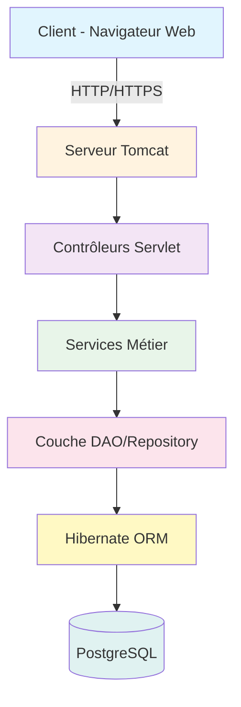
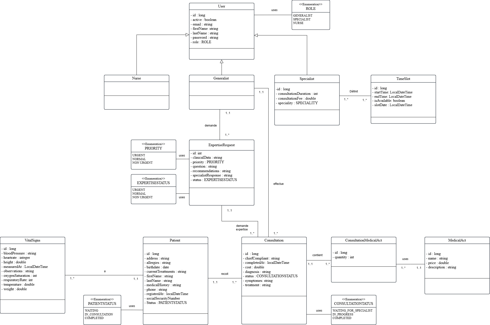

<div align="center">

# 🏥 CONSULEA - Système de Télé-Expertise Médicale


[](https://www.oracle.com/java/)
[](https://jakarta.ee/)
[](https://hibernate.org/)
[](https://www.postgresql.org/)
[](LICENSE)

### 🚀 **Optimisez le parcours patient avec la télé-expertise médicale**

*Une plateforme révolutionnaire pour connecter médecins généralistes et spécialistes en temps réel*


</div>

---

## 📋 Table des Matières

- [✨ À Propos](#-à-propos)
- [🎯 Fonctionnalités Principales](#-fonctionnalités-principales)
- [🏗️ Architecture](#️-architecture)
- [🛠️ Technologies Utilisées](#️-technologies-utilisées)
- [📸 Démonstration](#-captures-décran)
- [📊 Modélisation UML](#-modélisation-uml)
- [📝 Licence](#-licence)

---

## ✨ À Propos

**Consulea** est une plateforme de télé-expertise médicale innovante qui révolutionne la coordination des soins entre professionnels de santé. Notre système permet une collaboration fluide entre médecins généralistes et spécialistes, garantissant une prise en charge rapide et efficace des patients.

### 🎯 Objectifs du Projet

<div align="center">
<table>
<tr>
<td align="center" width="33%">

<br><b>⏱️ Gain de Temps</b>
<br><sub>Réduction du délai de prise en charge</sub>
</td>
<td align="center" width="33%">

<br><b>👨‍⚕️ Collaboration</b>
<br><sub>Échange facilité entre médecins</sub>
</td>
<td align="center" width="33%">

<br><b>❤️ Qualité des Soins</b>
<br><sub>Meilleure prise en charge patient</sub>
</td>
</tr>
</table>
</div>

---

## 🎯 Fonctionnalités Principales

### 👩‍⚕️ **Module Infirmier**
- ✅ Enregistrement rapide des patients
- 📊 Saisie des signes vitaux (tension, température, pouls...)
- 📋 Gestion de la file d'attente
- 🔍 Recherche et historique patients

### 👨‍⚕️ **Module Médecin Généraliste**
- 🩺 Création et gestion des consultations
- 📝 Demande d'expertise spécialisée
- 💊 Prescription et diagnostic
- 💰 Calcul automatique des coûts
- 📅 Visualisation des créneaux disponibles

### 🔬 **Module Médecin Spécialiste**
- ⚙️ Configuration du profil (tarif, spécialité)
- 📨 Réception des demandes d'expertise
- 💬 Réponse aux consultations avec recommandations
- 📈 Statistiques et revenus
- 🗓️ Gestion des créneaux horaires

---

## 🏗️ Architecture



### 📁 Structure du Projet

```
📦 consulea/
├── 📂 src/
│   ├── 📂 main/
│   │   ├── 📂 java/
│   │   │   └── 📂 com/consulea/
│   │   │       ├── 📂 controllers/    # Servlets & Contrôleurs
│   │   │       ├── 📂 models/         # Entités JPA
│   │   │       ├── 📂 services/       # Logique métier
│   │   │       ├── 📂 dao/            # Couche d'accès aux données
│   │   │       ├── 📂 utils/          # Classes utilitaires
│   │   │       └── 📂 filters/        # Filtres de sécurité
│   │   ├── 📂 resources/
│   │   │   ├── 📂 META-INF/
│   │   │   │   └── persistence.xml    # Configuration JPA
│   │   │   └── 📂 sql/
│   │   │       ├── schema.sql         # Structure BDD
│   │   │       └── data.sql           # Données initiales
│   │   └── 📂 webapp/
│   │       ├── 📂 WEB-INF/
│   │       │   ├── web.xml            # Configuration web
│   │       │   └── 📂 views/           # Pages JSP
│   │       ├── 📂 css/                # Styles
│   │       ├── 📂 js/                 # JavaScript
│   │       └── 📂 images/              # Images & icônes
│   └── 📂 test/
│       └── 📂 java/                    # Tests unitaires
├── 📂 docs/                            # Documentation
├── 📄 pom.xml                          # Configuration Maven
└── 📄 README.md                        # Ce fichier
```

---

## 🛠️ Technologies Utilisées

<div align="center">

### Backend
<p>


</p>

### Base de Données & ORM
<p>


</p>

### Frontend
<p>


</p>

### Serveur & Build
<p>


</p>

### Tests & Sécurité
<p>


</p>

### Outils de Développement
<p>


</p>

</div>

---

## 📦 Installation

### Prérequis

- ☕ **Java 17** ou supérieur
- 🐘 **PostgreSQL 15** ou supérieur
- 🔧 **Maven 3.8+**
- 🐱 **Tomcat 10** ou supérieur
- 💻 **IDE** (IntelliJ IDEA recommandé)

### 🔧 Configuration de la Base de Données

1. **Créer la base de données**
```sql
CREATE DATABASE Consulea;
CREATE USER consulea_user WITH PASSWORD 'your_password';
GRANT ALL PRIVILEGES ON DATABASE consulea_db TO consulea_user;
```

2. **Exécuter les scripts SQL**
```bash
psql -U consulea_user -d consulea_db -f src/main/resources/sql/schema.sql
psql -U consulea_user -d consulea_db -f src/main/resources/sql/data.sql
```

### ⚙️ Configuration de l'Application

1. **Cloner le repository**
```bash
git clone https://github.com/votre-username/consulea.git
cd consulea
```

2. **Configurer persistence.xml**
```xml
<property name="javax.persistence.jdbc.url" 
          value="jdbc:postgresql://localhost:5432/consulea_db"/>
<property name="javax.persistence.jdbc.user" value="consulea_user"/>
<property name="javax.persistence.jdbc.password" value="your_password"/>
```

3. **Compiler le projet**
```bash
mvn clean compile
```

---


## 📸 Démonstration

---

## 📊 Modélisation UML

### Diagramme de Classes

*Architecture complète du système avec toutes les entités et relations*

---

## 📝 Licence

Ce projet est sous licence MIT - voir le fichier [LICENSE](LICENSE) pour plus de détails.


</div>