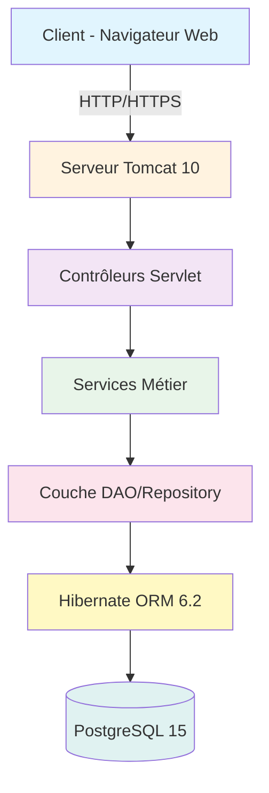

<div align="center">

# 🏥 CONSULEA - Système de Télé-Expertise Médicale

[](https://www.oracle.com/java/)
[](https://jakarta.ee/)
[](https://hibernate.org/)
[](https://www.postgresql.org/)
[](LICENSE)

### 🚀 **Optimisez le parcours patient avec la télé-expertise médicale**

*Une plateforme révolutionnaire pour connecter médecins généralistes et spécialistes en temps réel*

</div>

---

## 📋 Table des Matières

- [✨ À Propos](#-à-propos)
- [🎯 Fonctionnalités Principales](#-fonctionnalités-principales)
- [🏗️ Architecture](#️-architecture)
- [🛠️ Technologies Utilisées](#️-technologies-utilisées)
- [📦 Installation](#-installation)
- [🚀 Déploiement](#-déploiement)
- [📸 Démonstration](#-démonstration)
- [📊 Modélisation UML](#-modélisation-uml)
- [📝 Licence](#-licence)

---

## ✨ À Propos

**Consulea** est une plateforme de télé-expertise médicale innovante qui révolutionne la coordination des soins entre professionnels de santé. Notre système permet une collaboration fluide entre médecins généralistes et spécialistes, garantissant une prise en charge rapide et efficace des patients.

### 🎯 Objectifs du Projet

<div align="center">
<table>
<tr>
<td align="center" width="33%">

<br><b>⏱️ Gain de Temps</b>
<br><sub>Réduction du délai de prise en charge</sub>
</td>
<td align="center" width="33%">

<br><b>👨‍⚕️ Collaboration</b>
<br><sub>Échange facilité entre médecins</sub>
</td>
<td align="center" width="33%">

<br><b>❤️ Qualité des Soins</b>
<br><sub>Meilleure prise en charge patient</sub>
</td>
</tr>
</table>
</div>

---

## 🎯 Fonctionnalités Principales

### 👩‍⚕️ **Module Infirmier**
- ✅ Enregistrement rapide des patients
- 📊 Saisie des signes vitaux (tension, température, pouls, saturation O2, poids, taille...)
- 📋 Gestion de la file d'attente
- 🔍 Recherche et consultation de l'historique des patients
- 👤 Mise à jour des informations patients

### 👨‍⚕️ **Module Médecin Généraliste**
- 🩺 Création et gestion des consultations complètes
- 📝 Demande d'expertise spécialisée avec priorisation
- 💊 Saisie des diagnostics et traitements
- 💰 Calcul automatique des coûts avec actes médicaux
- 📅 Visualisation des créneaux disponibles des spécialistes
- 📋 Suivi des consultations (en cours, en attente d'avis, terminées)

### 🔬 **Module Médecin Spécialiste**
- ⚙️ Configuration du profil (spécialité, tarif de consultation)
- 📨 Réception et traitement des demandes d'expertise
- 💬 Réponse détaillée avec recommandations médicales
- 📈 Tableau de bord avec statistiques et revenus
- 🗓️ Gestion des créneaux horaires de disponibilité

---

## 🏗️ Architecture



### 📁 Structure du Projet

```
📦 consulea-PatientCareCoordinator/
├── 📂 src/
│   ├── 📂 main/
│   │   ├── 📂 java/
│   │   │   └── 📂 com/consulea/
│   │   │       ├── 📂 servlet/        # Servlets & Contrôleurs
│   │   │       ├── 📂 entity/         # Entités JPA
│   │   │       ├── 📂 service/        # Logique métier
│   │   │       ├── 📂 dao/            # Couche d'accès aux données
│   │   │       ├── 📂 enums/          # Énumérations
│   │   │       ├── 📂 util/           # Classes utilitaires
│   │   │       └── 📂 filter/         # Filtres de sécurité
│   │   ├── 📂 resources/
│   │   │   ├── 📂 META-INF/
│   │   │   │   └── persistence.xml    # Configuration JPA
│   │   │   └── 📂 sql/                # Scripts SQL
│   │   └── 📂 webapp/
│   │       ├── 📂 WEB-INF/
│   │       │   └── 📂 views/          # Pages JSP
│   │       │       ├── 📂 nurse/      # Vues infirmier
│   │       │       ├── 📂 doctor/     # Vues médecin
│   │       │       └── 📂 specialist/ # Vues spécialiste
│   │       ├── 📂 assets/             # Ressources statiques
│   │       └── index.jsp              # Page d'accueil
│   └── 📂 test/                       # Tests unitaires
├── 📂 UML/                            # Diagrammes UML
├── 📂 demo/                           # Vidéo de démonstration
├── 📂 Doc/                            # Documentation flows
├── 📄 pom.xml                         # Configuration Maven
└── 📄 README.md                       # Ce fichier
```

---

## 🛠️ Technologies Utilisées

<div align="center">

### Backend
<p>


</p>

### Base de Données & ORM
<p>


</p>

### Frontend
<p>


</p>

### Serveur & Build
<p>


</p>

### Tests & Sécurité
<p>


</p>

### Outils de Développement
<p>


</p>

</div>

---

## 📦 Installation

### Prérequis

- ☕ **Java 17** ou supérieur
- 🐘 **PostgreSQL 15** ou supérieur
- 🔧 **Maven 3.8+**
- 🐱 **Tomcat 10** ou supérieur
- 💻 **IDE** (IntelliJ IDEA recommandé)

### 🔧 Configuration de la Base de Données

1. **Créer la base de données**
```sql
CREATE DATABASE Consulea;
CREATE USER consulea_user WITH PASSWORD 'your_password';
GRANT ALL PRIVILEGES ON DATABASE Consulea TO consulea_user;
```

2. **Configurer persistence.xml**
```xml
<property name="jakarta.persistence.jdbc.url" 
          value="jdbc:postgresql://localhost:5432/Consulea"/>
<property name="jakarta.persistence.jdbc.user" value="consulea_user"/>
<property name="jakarta.persistence.jdbc.password" value="your_password"/>
```

### ⚙️ Configuration de l'Application

1. **Cloner le repository**
```bash
git clone https://github.com/votre-username/consulea-PatientCareCoordinator.git
cd consulea-PatientCareCoordinator
```

2. **Modifier la configuration de base de données**
   - Éditer `src/main/resources/META-INF/persistence.xml`
   - Mettre à jour les informations de connexion PostgreSQL

3. **Compiler le projet**
```bash
mvn clean compile
```

4. **Exécuter les tests**
```bash
mvn test
```

---

## 🚀 Déploiement

### Génération du fichier WAR

```bash
# Nettoyer et construire le projet
mvn clean package

# Le fichier WAR sera généré dans target/consulea.war
```

### Déploiement sur Tomcat

1. **Copier le fichier WAR**
```bash
cp target/consulea.war $TOMCAT_HOME/webapps/
```

2. **Démarrer Tomcat**
```bash
$TOMCAT_HOME/bin/startup.sh
```

3. **Accéder à l'application**
```
http://localhost:8080/consulea
```

### Comptes par défaut

- **Infirmier**: `infirmier@consulea.com` / `password123`
- **Médecin Généraliste**: `docteur@consulea.com` / `password123`
- **Médecin Spécialiste**: `specialiste@consulea.com` / `password123`

---

## 📸 Démonstration

### Vidéo de démonstration complète (clickez sur l'image dessous)

[](demo/consulea.mp4)

*Démonstration complète des fonctionnalités de la plateforme Consulea*

---

## 📊 Modélisation UML

### Diagramme de Classes


*Architecture complète du système avec toutes les entités, relations et annotations JPA*

### Entités Principales

- **User** : Gestion des utilisateurs (infirmiers, médecins, spécialistes)
- **Patient** : Informations des patients et historique médical
- **Consultation** : Consultations médicales avec diagnostic et traitement
- **ExpertiseRequest** : Demandes d'expertise entre médecins
- **Specialist** : Profils spécialisés des médecins spécialistes
- **TimeSlot** : Gestion des créneaux horaires
- **VitalSigns** : Signes vitaux des patients
- **MedicalAct** : Actes médicaux et tarification

---

## 📂 Documentation

### Flows Métier

- [**Nurse Flow**](Doc/Nurse-Flow.pdf) - Processus de travail des infirmiers
- [**Generalist Flow**](Doc/Generalist-Flow.pdf) - Processus de travail des médecins généralistes

### Fonctionnalités Détaillées

#### Gestion des Patients
- Enregistrement avec informations complètes
- Suivi des signes vitaux
- Historique médical complet

#### Système de Consultation
- Workflow complet de consultation
- Intégration des actes médicaux
- Calcul automatique des coûts

#### Télé-expertise
- Demandes priorisées
- Réservation de créneaux
- Réponses détaillées avec recommandations

---

## 🔧 Configuration Avancée

### Variables d'Environnement

```bash
# Base de données
DB_URL=jdbc:postgresql://localhost:5432/Consulea
DB_USER=consulea_user
DB_PASSWORD=your_password

# Serveur
SERVER_PORT=8080
CONTEXT_PATH=/consulea
```

### Profils Maven

```bash
# Développement
mvn clean package -Pdev

# Production
mvn clean package -Pprod
```

---

## 🐛 Dépannage

### Problèmes Courants

1. **Erreur de connexion à la base de données**
   - Vérifier que PostgreSQL est démarré
   - Contrôler les paramètres de connexion dans `persistence.xml`

2. **ClassNotFoundException**
   - Vérifier que toutes les dépendances sont dans le classpath
   - Rebuilder le projet : `mvn clean compile`

3. **Erreur de déploiement**
   - Vérifier que Tomcat 10+ est utilisé
   - Contrôler les logs dans `$TOMCAT_HOME/logs/catalina.out`

---

## 📝 Licence

Ce projet est sous licence MIT - voir le fichier [LICENSE](LICENSE) pour plus de détails.

---

<div align="center">

**Développé avec ❤️ pour améliorer les soins de santé**

*Consulea - Révolutionnons ensemble la télé-expertise médicale*

</div>